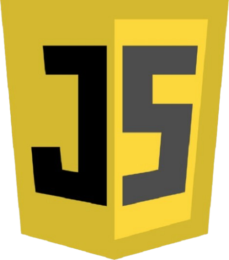

# Astro.

Hello! I'm Manuel. I've been programming since I was in school. If you'd like, you can learn more about me on my <a href="https://mmmanuel.netlify.app/">personal website</a>.

# Skills

Over time, driven by determination and curiosity, these are the skills I have acquired:

## Known Languages:

  
  
  
  
  

## Known Technologies and Libraries:

  
  
  
  
  

