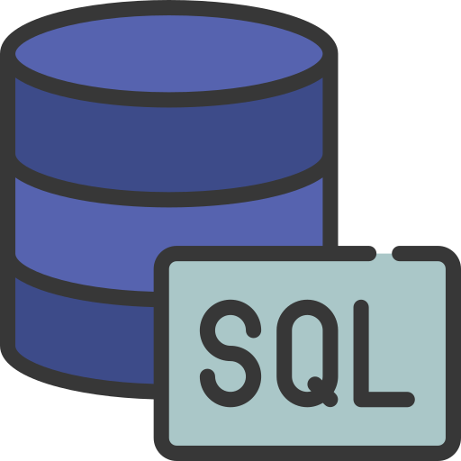

# Astro

Hello.  
My name is Manuel. I'm a Python developer specializing in libraries related to data science, with experience in Tkinter for building graphical user interfaces (GUIs).

## 🛠️ Known Languages:

  
   
  

## 📚 Known Libraries:

  
  
  
  

